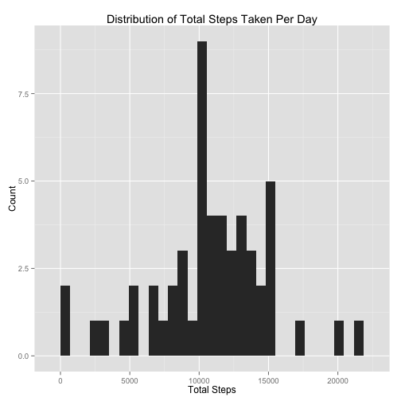
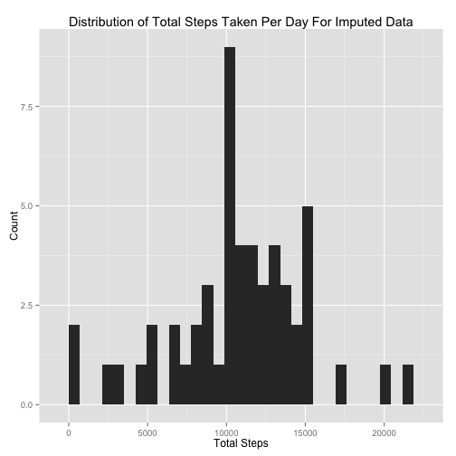
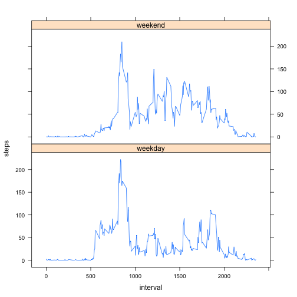

# Title: A Study Population Health And Economic Consequences Based On  NOAA Storm Database
###Shree Raj Shrestha
### August 16, 2014


## Loading and preprocessing the data
The following code was used to download the file. Using an if condition, the file is downloaded only if the file does not already exist.


```r
if(!file.exists("./data/activity.csv")) {
    url = "https://d396qusza40orc.cloudfront.net/repdata%2Fdata%2Factivity.zip"
    download.file(url,destfile="./data/archieved_data.zip", method="curl")
    unzip("./data/archieved_data.zip", exdir = "./data")
}
```

Using the `read.csv` function, the downloaded csv file was read into a variable named **rawdata**.


```r
rawdata <- read.csv("./data/activity.csv")
```

Then, required packages were downloaded and installed. For the scope of this assignment, the **reshape2** package and the **ggplot2** packages are required. The packages are imported into the library using the `library()` function.


```r
if("reshape2" %in% rownames(installed.packages()) == FALSE) {
    install.packages("reshape2")
}
library(reshape2)

if("ggplot2" %in% rownames(installed.packages()) == FALSE) {
    install.packages("ggplot2")
}
library(ggplot2)

if("lattice" %in% rownames(installed.packages()) == FALSE) {
    install.packages("lattice")
}
library(lattice)
```

### Melting the data
The **rawdata** is then melted into a data frame with id variables **date** and **interval**, and measured variable **steps** using the `melt` function from the **reshape2** package.


```r
datamelt <- melt(rawdata, id = c("date","interval"), measure.vars = c("steps"))
```


## What is mean total number of steps taken per day?
For the purpose of calculating the total number of steps taken per day, the melted data in the **datamelt** variable is now cast into a new data-frame named **totalstepsperday** with respect to **date** and as a sum of the variable **steps** which is plotted using the `ggplot()` and `geom_histogram()` functions in the **ggplot2** package. Furthermore, the parameters of the histogram is changed by assigning the initial plot to **histogram** and modifying its parameters. The binwidth parameter of is defaulted to range/30 and is left unchanged.


```r
totalstepsperday <- dcast( datamelt, date ~ variable, sum)
colnames(totalstepsperday) <- c("Date","Total_Steps")
histogram <- ggplot (totalstepsperday, aes (x = Total_Steps)) + geom_histogram() 
histogram <- histogram + xlab("Total Steps") + ylab("Count") + ggtitle("Distribution of Total Steps Taken Per Day") 
plot( histogram )
```

 

The mean and the median values for the total steps per day were calculated using the `mean()` and the `median()` function respectively. `NA` values were ignored by setting the `na.rm` parameter to `T`. The columns were changed to numeric type for calculation.


```r
totalmean <- mean( as.numeric(totalstepsperday$Total_Steps), na.rm = T)
totalmedian <- median( as.numeric(totalstepsperday$Total_Steps), na.rm = T)
```

The mean and the median of total steps per day was calculated to be **1.0766 &times; 10<sup>4</sup>** and **1.0765 &times; 10<sup>4</sup>** respectively.


## What is the average daily activity pattern?
For the purpose of calculating the average daily activity pattern, the melted data in the **datamelt** variable is now cast into a new data-frame named **intervalaverage** with respect to **interval** and as a average of the variable **steps**. `NA` values are ignored by setting the `na.rm` parameter of the `dcast()` function to `T`. A time series plot of the **Interval** across the **Average_Across_All_Days** is plotted using the plot function. 


```r
intervalaverage <- dcast( datamelt, interval ~ variable, mean, na.rm =T)
colnames(intervalaverage) <- c("Interval", "Average_Across_All_Days")
plot(intervalaverage, type = "l", xlab = "5-minute Interval", ylab = "Average Number of Steps", main = "Average Daily Activity Pattern")
```

 

The index of the maximum average value is calculated using the `which()` function. The interval with the maximum average daily activity is stored in **maxinterval** variable.


```r
maxindex <- which.max(intervalaverage$Average_Across_All_Days)
maxinterval <- intervalaverage[maxindex,1]
```

The 5-minute interval that, on average across all the days in the dataset, contains the maximum number of steps is **835**.

## Imputing missing values


```r
numberofnas <- sum(is.na(rawdata$steps))
naindex <- which(is.na(rawdata$steps))
naintervals <- rawdata[naindex,3]
imputeddata <- rawdata
```

Using the `sum()` function in conjuction with `is.na()` function, the total number of `NA` values was calculated and stored in the variable **numberofnas**, which was equal to **2304**. Furthermore, the index of the rows in the raw data containing `NA` values was store in the variable **naindex**. The intervals for which there was an `NA` value was stored in a variable **naintervals** and the **rawdata** was copied to **imputeddata**, in which the `NA` values were replaced using the average for that corresponding interval.

The following loop was used to substitue the `NA` values in the **imputeddata** with the average from the **intervalaverage**.


```r
for (i in 1:length(naindex) ) {
    intervalrow <- which(intervalaverage$Interval == rawdata[naindex,3][i])
    imputeddata[naindex,1][i] <- intervalaverage[intervalrow,2]
}
```

For the **imputeddata** dataset the total number of `NA` was none.

```r
nainimputeddata <- sum(is.na(imputeddata$steps))
print(nainimputeddata)
```

The same process applied to the rawdata to make the histogram is applied to the data set **imputeddata**.


```r
# Melting the imputeddata
imputeddatamelt <- melt(imputeddata, id = c("date","interval"), measure.vars = c("steps"))

# Plotting histogram with mean and median lines for totalstepsperdayimputed
totalstepsperdayimputed <- dcast( imputeddatamelt, date ~ variable, sum)
colnames(totalstepsperdayimputed) <- c("Date","Total_Steps")
histogram2 <- ggplot (totalstepsperday, aes (x = Total_Steps)) + geom_histogram() 
histogram2 <- histogram2 + xlab("Total Steps") + ylab("Count") + ggtitle("Distribution of Total Steps Taken Per Day For Imputed Data") 
plot( histogram2 )
```

 

```r
# Calculating mean and median for totalstepsperdayimputed
totalmeanimputed <- mean( as.numeric(totalstepsperdayimputed$Total_Steps), na.rm = T)
totalmedianimputed <- median( as.numeric(totalstepsperdayimputed$Total_Steps), na.rm = T)
```

The mean and the median after imputing the missing values were **1.0766 &times; 10<sup>4</sup>** and **1.0766 &times; 10<sup>4</sup>** respectively. It can be concluded that after imputation, the median value became equal to the mean because of substitutions of the missing intervals with average steps for its corresponding interval.

## Are there differences in activity patterns between weekdays and weekends?


```r
# Generating the day of the week for all days in the imputed data into a fourth column
for (i in 1:nrow(imputeddata) ) {
    if ( weekdays(as.Date(imputeddata$date[i], "%Y-%m-%d")) %in% c("Friday","Saturday", "Sunday") ) {
        imputeddata[i,4] = "weekend"
    } else {
        imputeddata[i,4] = "weekday"
    }
}

# Formatting the fourth column as a factor
colnames(imputeddata)[4] <- "day"
imputeddata$day <- as.factor(imputeddata$day)

# Melting and casting the imputed data into desired form
meltedimputeddata <- melt( imputeddata, id = c("date","interval", "day"), measure.vars = "steps" )
castimputeddata <- dcast( meltedimputeddata, interval + day ~ variable, mean )

# Plotting the panelgraph
activitydifference <- xyplot(steps ~ interval | day, data = castimputeddata, type = "l", layout = c(1,2) )
plot(activitydifference)
```

 

By investigating the panel plot containing a time series plot (i.e. type = "l") of the 5-minute interval (x-axis) and the average number of steps taken, averaged across all weekday days or weekend days (y-axis), we can see that there is a difference in activity pattern between weekdays and weekend.

